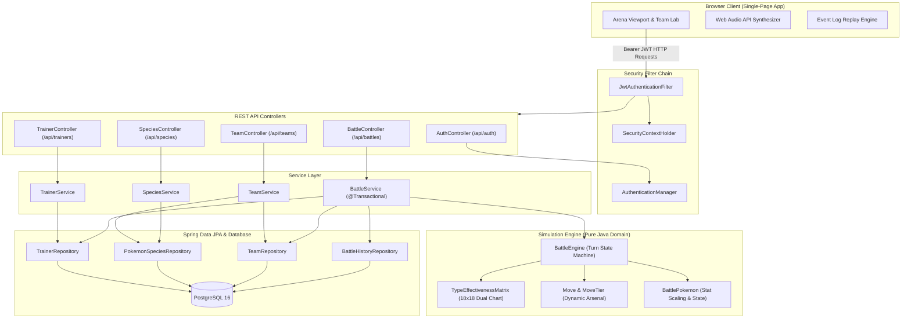
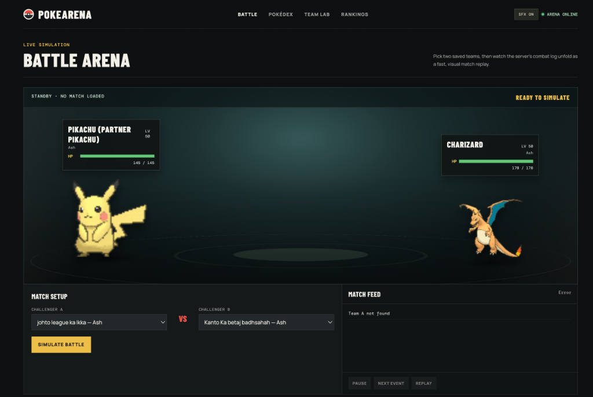
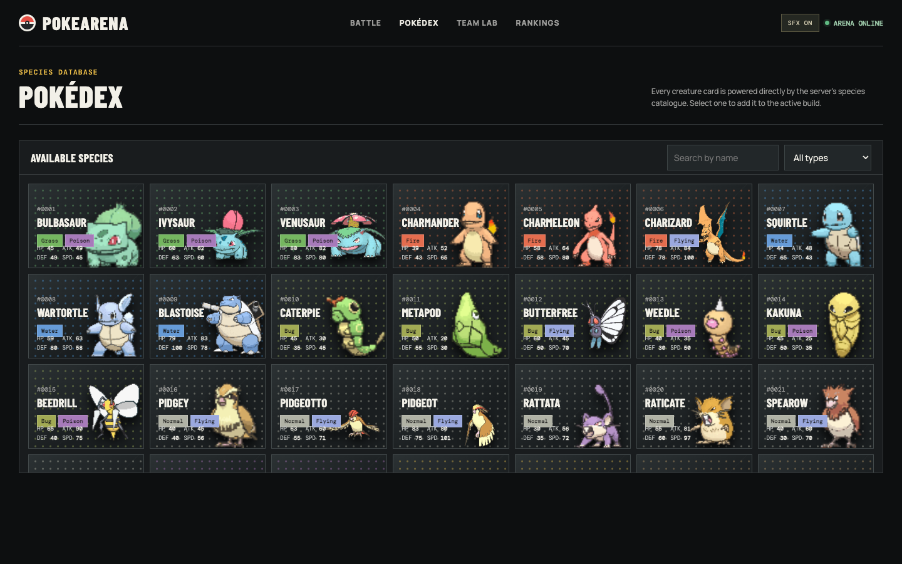
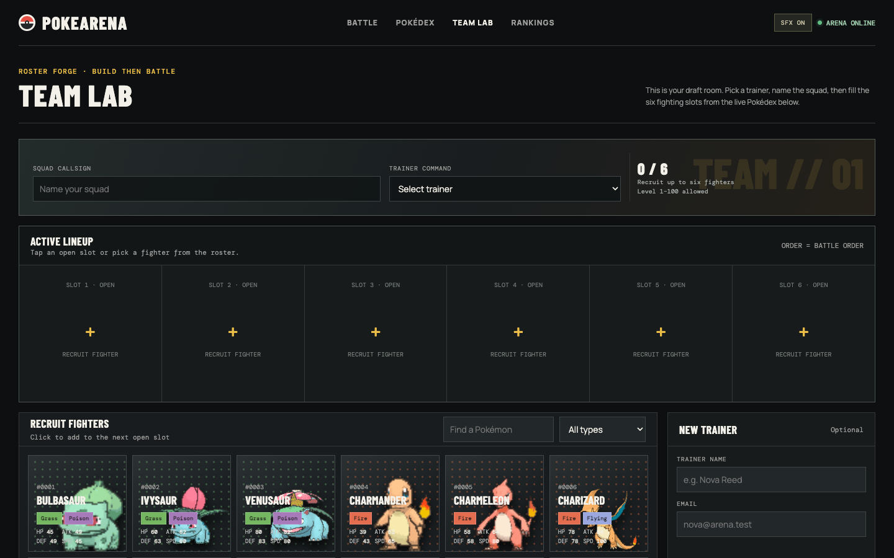
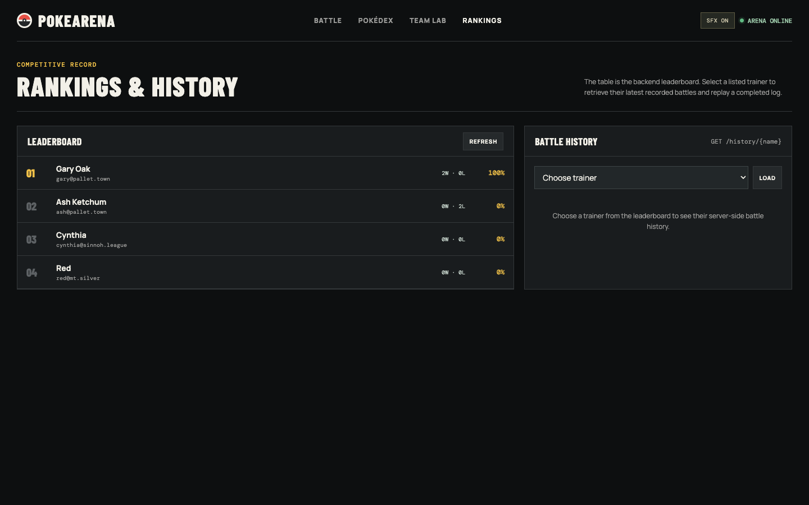

# PokeArena

A full-stack, turn-based Pokémon combat simulation platform and roster laboratory built with Java 25, Spring Boot, Spring Data JPA, and PostgreSQL.

PokeArena models full-scale team combat across all 9 generations (1,215 species). Instead of acting as a passive database viewer, the backend executes a standalone, state-driven combat engine featuring an 18-type compound effectiveness matrix, dynamic elemental move arsenals, speed-priority turn resolution, stat scaling by level, tactical counter-switching heuristics, and round-by-round combat logging for visual replay.

---

## How It Works

PokeArena is split into two integrated tiers: a **Deterministic In-Memory Simulation Engine** running inside Spring Boot and an **Event-Driven Browser Client** that translates the server's combat journal into animated sprite battles with synthesized sound effects.



---

## Engineering Deep Dives

### 1. Speed-Priority Turn Resolution & Combat State Machine
In turn-based game simulations, race conditions between simultaneous actions must be resolved deterministically. The combat loop in `BattleEngine` calculates a dynamic initiative check every round by comparing effective speed stats (base speed scaled by level).

The faster combatant attacks first. If the defender's HP reaches zero, it faints immediately and forfeits its attack for that turn, triggering a bench switch-in. If the defender survives, it executes a counter-attack. The entire sequence is recorded into an append-only event stream (`List<String> battleLog`) that captures:
- Attack announcements and target names
- Hit vs. miss accuracy outcomes
- Super-effective ($4\times, 2\times$), resisted ($0.5\times, 0.25\times$), and immune ($0\times$) multipliers
- Damage dealt and remaining HP fractions
- Faint events, bench switch-ins, and match outcome

$$\text{Damage} = \left(\left(\frac{2 \times \text{Level}}{5} + 2\right) \times \text{Power} \times \frac{\text{Attack}}{\text{Defense}} \times \frac{1}{50} + 2\right) \times \text{STAB} \times \text{Multiplier}$$

### 2. The Dynamic Elemental Arsenal (Beyond 4-Move Limits)
In the original Game Boy titles, Pokémon were constrained to 4 moves due to 8-bit memory constraints and controller layouts. In an automated server simulation, that restriction produces repetitive, predictable combat loops.

PokeArena implements a **Dynamic Elemental Arsenal**:
- Each Pokémon has real-time command over all moves matching its **Primary Type**, its **Secondary Type**, and universal **Normal combat moves**.
- Moves are codified in a type-safe enum (`Move`) across 4 tactical tiers:
  - `LIGHT`: 40 Power, 100% Accuracy (e.g., *Quick Attack*, *Ember*, *Water Gun*)
  - `STANDARD`: 75–90 Power, 100% Accuracy (e.g., *Flamethrower*, *Surf*, *Thunderbolt*)
  - `HEAVY`: 100–120 Power, 75–85% Accuracy (e.g., *Fire Blast*, *Hydro Pump*, *Stone Edge*)
  - `ULTIMATE`: 130–150 Power, 60–80% Accuracy (e.g., *Hyper Beam*, *Solar Beam*, *Overheat*)
- **Desperation / Clutch Mechanic**: When a Pokémon's current HP drops below 25%, probability weighting shifts dynamically toward `HEAVY` (25%) and `ULTIMATE` (15%) moves, simulating an anime-style last stand.
- **STAB (Same-Type Attack Bonus)**: Grants an authentic $1.5\times$ damage multiplier when an attack matches the Pokémon's innate typing.

### 3. Compound Dual-Typing Effectiveness Matrix
Many Pokémon possess two distinct elemental types (e.g., Charizard is Fire/Flying, Swampert is Water/Ground). A single-type chart fails to capture real combat dynamics.

`TypeEffectivenessMatrix` models all 18 elemental types and computes compound defense multipliers:
$$\text{Multiplier} = \text{Chart}[\text{MoveType}][\text{DefType}_1] \times \text{Chart}[\text{MoveType}][\text{DefType}_2]$$

This yields authentic compound outcomes:
- **4.0× Double Super-Effective**: Rock vs. Charizard (Fire / Flying)
- **2.0× Super-Effective**: Water vs. Fire
- **1.0× Neutral**: Water vs. Grass / Flying (2.0× and 0.5× cancel out)
- **0.5× Resisted**: Fire vs. Water
- **0.25× Double Resisted**: Grass vs. Charizard (Fire / Flying)
- **0.0× Full Immunity**: Electric vs. Swampert (Water / Ground)

### 4. Tactical Counter-Switching Heuristic (Trainer AI)
Standard student projects cycle through team arrays sequentially ($0 \to 1 \to 2$). When a Grass-type faints against a Fire-type, a sequential loop blindly sends out the next Grass-type to be knocked out.

`BattleEngine.selectNextPokemon` implements a **Hierarchical Decision Heuristic**:
1. **Surviving Pool**: Filters the team down to combatants where `!isFainted()`.
2. **75% Tactical Counter Search**: Iterates through surviving bench candidates and evaluates whether their primary or secondary type deals $\ge 2.0\times$ super-effective damage against the opponent currently on the field. If multiple counters exist, one is selected at random.
3. **25% Wildcard / Fallback**: If no counter exists on the bench or if the 25% wildcard branch is triggered, a random surviving teammate is deployed.

### 5. High-Throughput Startup Ingestion & Form Deduplication
On boot, `DataSeeder` streams `Pokemon.csv` into memory:
- Handles composite name resolution: Alternate forms, Mega Evolutions, and regional variants (e.g., `Charizard (Mega Charizard X)`, `Raichu (Alolan Form)`) are dynamically parsed to prevent database unique constraint collisions.
- Idempotent execution: Verifies table count before execution to prevent duplicate seeding across service restarts.

### 6. Stateless Authentication & Boundary Isolation
- **Stateless JWT**: Authentication requests to `/api/auth/login` and `/api/auth/register` return signed HMAC-SHA256 tokens.
- **Security Filter Chain**: `JwtAuthenticationFilter` intercepts incoming requests, extracts the Bearer token, validates signature and expiration, and populates the `SecurityContextHolder`.
- Passwords stored as one-way salt-hashed hashes via `BCryptPasswordEncoder`.

---

## Screenshots

### 1. Battle Arena
Live visual replay of the backend simulation log with animated Showdown sprites, dynamic HP gauges, damage popups, move banners, and Web Audio API synthesized sound effects.



### 2. Pokédex Browser (1,215 Species)
Catalogue of all 9 generations loaded on startup from CSV, featuring base stats, dual typing, and instant client-side filtering.



### 3. Team Lab (Roster Forge)
Draft 1 to 6 Pokémon into custom squads, calibrate levels from 1 to 100, inspect elemental coverage, and deploy directly to the arena.



### 4. Competitive Leaderboard & Replay History
Live competitive standings tracking win rates and storing complete round-by-round match histories for instant replay.



---

## Domain Model & Schema

The relational schema is normalized across 5 core entities:
- **`Trainer`**: Profile, BCrypt password hash, wins, losses, role.
- **`PokemonSpecies`**: Canonical species dictionary (1,215 records) with base HP, Attack, Defense, Speed, and primary/secondary elemental types.
- **`Team`**: Squad entity associated with a `Trainer` ($N:1$). Cascades all lifecycle operations to its members with orphan removal.
- **`TeamMember`**: Roster slot entity ($N:1$ with `Team`, $N:1$ with `PokemonSpecies`) holding custom level ($1\text{–}100$) and slot order ($1\text{–}6$).
- **`BattleHistory`**: Match outcomes, timestamps, round count, and serialized match log events (`@ElementCollection`).

---

## REST API Reference

### Public Endpoints
| Method | Path | Description |
| :--- | :--- | :--- |
| `POST` | `/api/auth/register` | Register a new trainer account with name, email, and password |
| `POST` | `/api/auth/login` | Authenticate credentials and receive a stateless JWT Bearer token |
| `GET` | `/api/species` | Retrieve all 1,215 catalogued Pokémon species with base stats |
| `GET` | `/api/leaderboard` | Retrieve top 10 trainers ranked by total wins |

### Protected Endpoints (Requires `Authorization: Bearer <token>`)
| Method | Path | Description |
| :--- | :--- | :--- |
| `POST` | `/api/teams` | Create a squad with 1 to 6 Pokémon members, levels, and slot orders |
| `POST` | `/api/battles/simulate` | Execute a battle simulation between two team IDs |
| `GET` | `/api/battles/history/{trainerName}` | Retrieve historical match logs for a specific trainer |

---

## Local Development Setup

### Prerequisites
- **Java 21 or Java 25**
- **PostgreSQL 14+** running locally on port `5432`
- Maven wrapper included (`./mvnw`)

### 1. Database Setup
Create a PostgreSQL database named `pokearena`:

```sql
CREATE DATABASE pokearena;
```

### 2. Configure Credentials
Update `src/main/resources/application.properties` to match your local PostgreSQL configuration:

```properties
server.port=8088

spring.datasource.url=jdbc:postgresql://localhost:5432/pokearena
spring.datasource.username=postgres
spring.datasource.password=your_password
spring.datasource.driver-class-name=org.postgresql.Driver

spring.jpa.database-platform=org.hibernate.dialect.PostgreSQLDialect
spring.jpa.hibernate.ddl-auto=update
```

### 3. Build & Run
```bash
./mvnw spring-boot:run
```

Once started, navigate to `http://localhost:8088` in your browser.

---

## License

This project is open-source under the [MIT License](LICENSE). Pokémon and Pokémon character names are trademarks of Nintendo, Creatures Inc., and GAME FREAK Inc.
