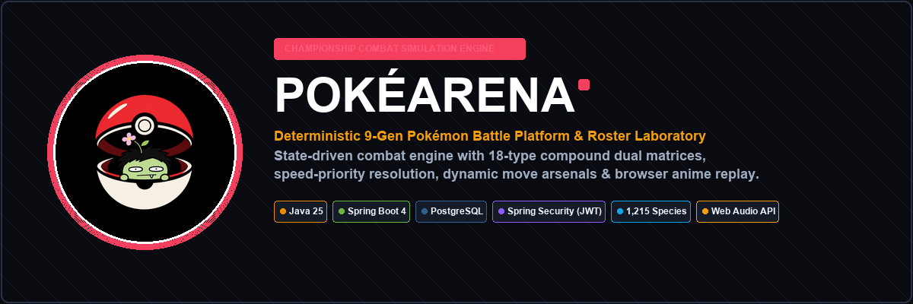
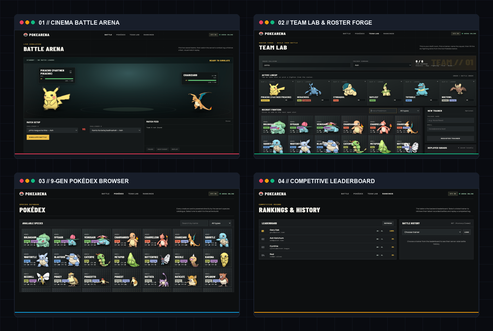
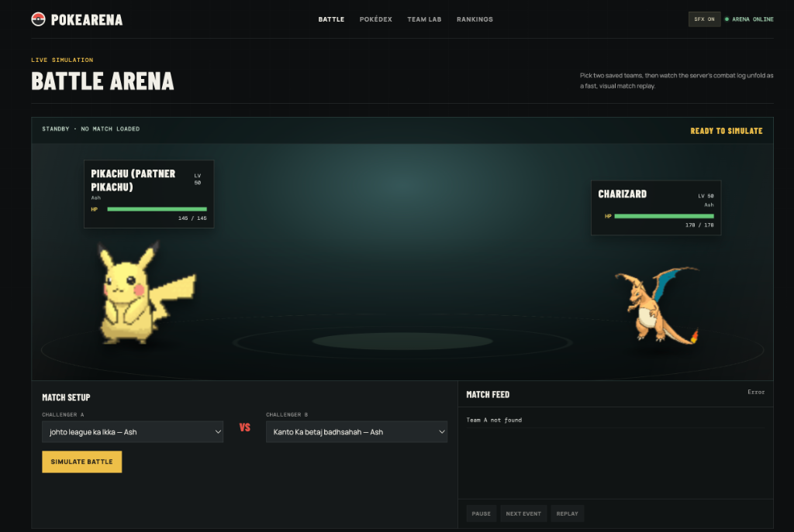
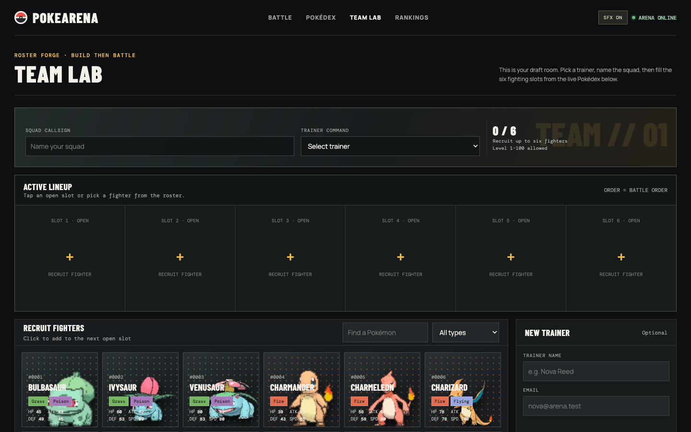
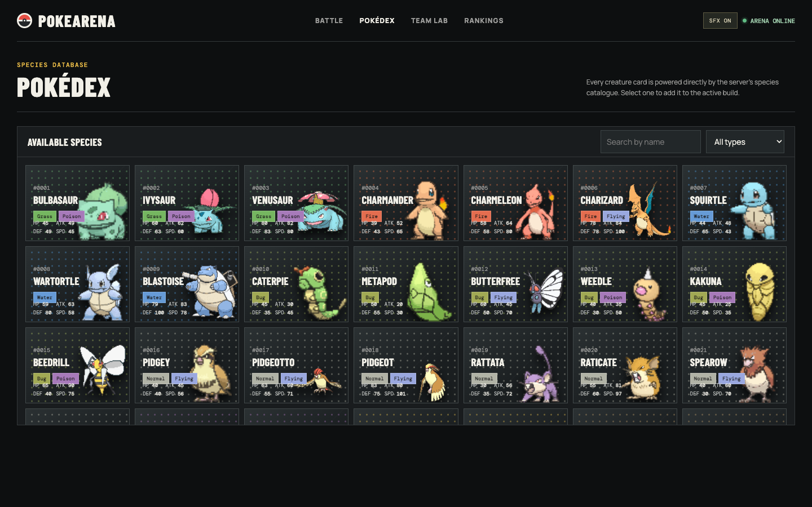
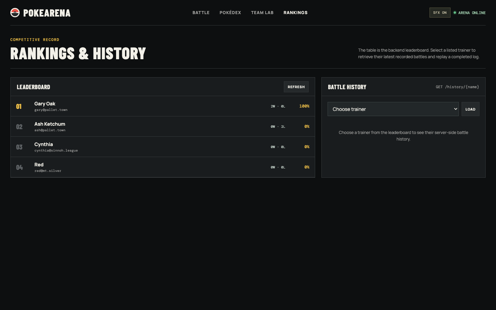
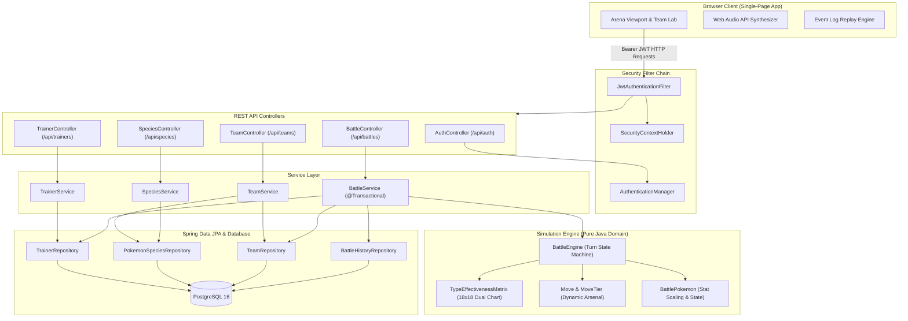
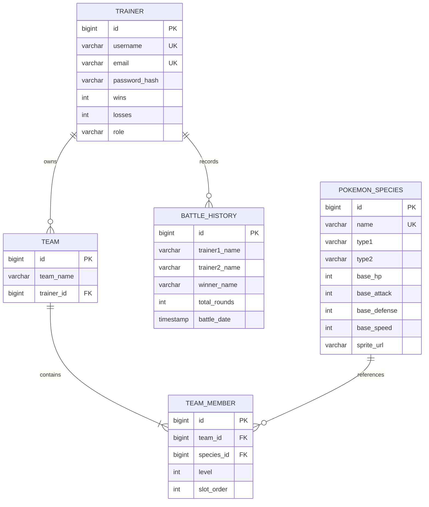

<div align="center">



<br/>

[](https://openjdk.org/)
[](https://spring.io/projects/spring-boot)
[](https://www.postgresql.org/)
[](https://spring.io/projects/spring-security)
[](#-domain-model--schema)
[](#1-cinema-battle-arena)
[](LICENSE)

<br/>

<p align="center">
  <strong>High-Octane Turn-Based Combat Simulation Engine & Competitive Roster Laboratory</strong>
  <br/>
  Featuring an 18×18 compound dual-typing matrix, dynamic elemental move arsenals, speed-priority turn resolution, stat scaling by level, tactical counter-switching heuristics, and round-by-round visual replay.
</p>

[Explore Features](#-feature-showcase) • [Architecture](#-architecture--data-flow) • [Combat Mechanics](#-combat-engine--simulation-mechanics) • [Domain Model](#-domain-model--schema) • [REST API](#-rest-api-reference) • [Quick Start](#-quick-start--local-development)

</div>

---

## ⚡ Overview

**PokéArena** models competitive Pokémon team combat across all **9 generations (1,215 catalogued species)**. Rather than acting as a static database browser, the backend runs a standalone, deterministic simulation state machine that resolves complete 6v6 squad engagements in milliseconds, streaming an immutable event ledger to an anime-inspired browser client for cinematic replay with procedural audio synthesis.

```
                    ┌────────────────────────────────────────────────────────┐
                    │                      POKÉARENA                         │
                    │   Turn-Based Championship Combat Simulation Engine     │
                    └───────────────────────────┬────────────────────────────┘
                                                │
                 ┌──────────────────────────────┴──────────────────────────────┐
                 ▼                                                             ▼
   ┌───────────────────────────┐                                 ┌───────────────────────────┐
   │     BACKEND ENGINE        │                                 │     FRONTEND CLIENT       │
   │  • Deterministic State    │   REST API + Bearer JWT Token   │  • Anime Battle Arena     │
   │  • 18×18 Dual Typing      │ ◄─────────────────────────────► │  • 1,215-Species Pokédex  │
   │  • Level 1-100 Scaling    │       Event Log Replay JSON     │  • Team Lab / Roster Forge│
   │  • Tactical Counter AI    │                                 │  • Web Audio Synthesizer  │
   └───────────────────────────┘                                 └───────────────────────────┘
```

---

## 🖼️ Feature Showcase

<div align="center">
  
</div>

<br/>

### 1. Cinema Battle Arena
* **Spectator Simulation Mode**: Two teams enter; one emerges victorious. Zero manual button mashing—watch server-calculated battles unfold in authentic anime style.
* **Cinematic Presentation**: Showdown animated sprites, elemental screen flashes, GSAP lunges, impact shockwaves, screen shakes, dynamic camera angles, and floating critical damage text.
* **Web Audio Procedural Sound Director**: Built-in sound synthesizer generating whooshes, sub-bass impacts, electric crackles, and crowd cheers directly in the browser—zero external audio file dependencies.
* **Intelligent Bench Cycling**: When an active combatant faints, a dramatic faint collapse triggers, followed by a Pokéball throw summon bringing the next squad member into battle.

<details>
<summary><b>🔍 Expand Arena Screenshot Preview</b></summary>
<br/>



</details>

---

### 2. Team Lab & Roster Forge
* **Custom Squad Assembly**: Draft 1 to 6 Pokémon into personalized battle squads.
* **Full Level Calibration**: Calibrate individual member levels anywhere from $1$ to $100$, with all baseline stats (HP, Attack, Defense, Speed) automatically scaling via canonical formulas.
* **Elemental Coverage Meter**: Visual feedback showing elemental type distribution across your active roster.
* **Seamless Deployment**: Deploy custom teams directly into exhibition matches or competitive rankings.

<details>
<summary><b>🔍 Expand Team Lab Screenshot Preview</b></summary>
<br/>



</details>

---

### 3. 9-Gen Pokédex (1,215 Species)
* **Complete Canonical Roster**: Spans Generation 1 through Generation 9, including regional forms and Mega Evolutions.
* **Stat Radar & Typings**: Inspect base HP, Attack, Defense, Speed, Primary Type, and Secondary Type at a glance.
* **Instant Client-Side Filtering**: Filter by name or elemental type in real time with zero latency.

<details>
<summary><b>🔍 Expand Pokédex Screenshot Preview</b></summary>
<br/>



</details>

---

### 4. Competitive Leaderboard & Match Replay
* **Trainer Standings**: Live competitive rankings tracking total wins, losses, and win percentages.
* **Full Match Journal Replay**: Every battle persists a complete round-by-round event log (`@ElementCollection`) enabling full visual replay at any point in time.

<details>
<summary><b>🔍 Expand Leaderboard Screenshot Preview</b></summary>
<br/>



</details>

---

## 🏛️ Architecture & Data Flow

PokéArena follows clean architectural separation between an in-memory simulation engine, transactional service orchestration, stateless security filters, and browser-driven event replay.


```mermaid
graph TD
    subgraph Client ["Browser Client (Single-Page App)"]
        UI["Arena Viewport & Team Lab"]
        Audio["Web Audio API Synthesizer"]
        Replay["Event Log Replay Engine"]
    end

    subgraph Security ["Security Filter Chain"]
        JWTFilter["JwtAuthenticationFilter"]
        SecCtx["SecurityContextHolder"]
        AuthMgr["AuthenticationManager"]
    end

    subgraph Controllers ["REST API Controllers"]
        AuthCtrl["AuthController (/api/auth)"]
        SpecCtrl["SpeciesController (/api/species)"]
        TeamCtrl["TeamController (/api/teams)"]
        BattleCtrl["BattleController (/api/battles)"]
        TrainCtrl["TrainerController (/api/trainers)"]
    end

    subgraph Services ["Service Layer"]
        TrainServ["TrainerService"]
        SpecServ["SpeciesService"]
        TeamServ["TeamService"]
        BattleServ["BattleService (@Transactional)"]
    end

    subgraph Engine ["Simulation Engine (Pure Java Domain)"]
        BattleEng["BattleEngine (Turn State Machine)"]
        TypeMatrix["TypeEffectivenessMatrix (18x18 Dual Chart)"]
        MoveEnum["Move & MoveTier (Dynamic Arsenal)"]
        BattleMon["BattlePokemon (Stat Scaling & State)"]
    end

    subgraph Persistence ["Spring Data JPA & Database"]
        TrainRepo["TrainerRepository"]
        SpecRepo["PokemonSpeciesRepository"]
        TeamRepo["TeamRepository"]
        HistRepo["BattleHistoryRepository"]
        Postgres[("PostgreSQL 16")]
    end

    UI -->|Bearer JWT HTTP Requests| JWTFilter
    JWTFilter --> SecCtx
    JWTFilter --> Controllers

    AuthCtrl --> AuthMgr
    SpecCtrl --> SpecServ
    TeamCtrl --> TeamServ
    BattleCtrl --> BattleServ
    TrainCtrl --> TrainServ

    TeamServ --> TeamRepo
    TeamServ --> SpecRepo
    SpecServ --> SpecRepo
    TrainServ --> TrainRepo

    BattleServ --> TeamRepo
    BattleServ --> BattleEng
    BattleServ --> HistRepo
    BattleServ --> TrainRepo

    BattleEng --> TypeMatrix
    BattleEng --> MoveEnum
    BattleEng --> BattleMon

    TrainRepo --> Postgres
    SpecRepo --> Postgres
    TeamRepo --> Postgres
    HistRepo --> Postgres
```

---

## ⚙️ Combat Engine & Simulation Mechanics

### 1. Speed-Priority Turn Resolution & State Machine
Simultaneous combat actions are resolved deterministically each round:
1. **Initiative Calculation**: Effective speed stats ($\text{Base Speed} \times \text{Level Scale}$) are evaluated.
2. **First Striker Phase**: Faster combatant launches its chosen move. Accuracy check is evaluated. Damage is calculated and applied to the defender.
3. **Faint & Forfeit Check**: If defender HP drops to $0$, it faints immediately and **forfeits** its counter-attack for that round.
4. **Counter-Attack Phase**: If the defender survives, it executes its move against the initial attacker.
5. **Round Closure**: Logs are written to an append-only event stream (`List<String> battleLog`).

```
                ┌────────────────────────────────┐
                │        ROUND INITIATION        │
                │ Compare Effective Speed Stats  │
                └───────────────┬────────────────┘
                                │
                                ▼
                ┌────────────────────────────────┐
                │       FAST POKÉMON ATTACKS     │
                │ Accuracy Check → Apply Damage  │
                └───────────────┬────────────────┘
                                │
                   Defender HP ≤ 0?
                   ├── YES ──► [Defender Faints] ──► [Bench Switch-In]
                   │
                   └── NO  ──► ┌────────────────────────────────┐
                               │       SLOW POKÉMON ATTACKS     │
                               │ Accuracy Check → Apply Damage  │
                               └───────────────┬────────────────┘
                                               │
                                  Attacker HP ≤ 0?
                                  ├── YES ──► [Attacker Faints] ──► [Bench Switch-In]
                                  └── NO  ──► [Advance to Next Round]
```

### 2. Canonical Combat Math
Damage calculations follow the official Gen V/VI/VII competitive mechanics formula with compound modifiers:

$$\text{Damage} = \left(\left(\frac{2 \times \text{Level}}{5} + 2\right) \times \text{Power} \times \frac{\text{Attack}}{\text{Defense}} \times \frac{1}{50} + 2\right) \times \text{STAB} \times \text{Multiplier} \times \text{Random}(0.85, 1.00)$$

* **STAB (Same-Type Attack Bonus)**: Grants a $1.5\times$ damage boost when an attack matches the Pokémon's innate type.
* **Accuracy Roll**: Roll $R \in [1, 100]$. If $R \le \text{Accuracy}$, the attack lands; otherwise, a miss event is logged.

### 3. Dynamic Elemental Arsenals (Beyond 4-Move Limits)
To eliminate repetitive 4-move loops in automated simulation, Pokémon command all moves matching their **Primary Type**, **Secondary Type**, and universal **Normal moves**, categorized into 4 tactical tiers:

| Tier | Power | Accuracy | Representative Moves | Selection Weight (Healthy) | Selection Weight (Clutch $<25\%$ HP) |
| :--- | :---: | :---: | :--- | :---: | :---: |
| **LIGHT** | 40 | 100% | *Quick Attack, Ember, Water Gun, Vine Whip* | 35% | 15% |
| **STANDARD** | 75–90 | 100% | *Flamethrower, Surf, Thunderbolt, Energy Ball* | 40% | 45% |
| **HEAVY** | 100–120 | 75–85% | *Fire Blast, Hydro Pump, Stone Edge, Blizzard* | 20% | 25% |
| **ULTIMATE** | 130–150 | 60–80% | *Hyper Beam, Solar Beam, Overheat, Focus Blast* | 5% | 15% |

> **Clutch / Desperation Mechanic**: When HP drops below $25\%$, the probability distribution shifts toward Heavy and Ultimate moves for dramatic, clutch anime comebacks.

### 4. 18×18 Compound Dual-Typing Effectiveness Matrix
Dual-typed Pokémon (e.g., Charizard: Fire/Flying; Swampert: Water/Ground) resolve defensive multipliers multiplicatively across both types:

$$\text{Multiplier} = \text{Matrix}[\text{MoveType}][\text{DefType}_1] \times \text{Matrix}[\text{MoveType}][\text{DefType}_2]$$

* **$4.0\times$ Double Super-Effective**: Rock vs. Charizard (Fire / Flying)
* **$2.0\times$ Super-Effective**: Water vs. Fire
* **$1.0\times$ Neutral**: Water vs. Grass / Flying ($2.0\times \times 0.5\times = 1.0\times$)
* **$0.5\times$ Resisted**: Fire vs. Water
* **$0.25\times$ Double Resisted**: Grass vs. Charizard (Fire / Flying)
* **$0.0\times$ Complete Immunity**: Electric vs. Swampert (Water / Ground)

### 5. Tactical Counter-Switching Heuristic (Trainer AI)
When a Pokémon faints, the trainer AI does not blindly cycle $0 \to 1 \to 2$. It executes a tactical heuristic:
1. **Surviving Pool**: Filters roster to active candidates where `!isFainted()`.
2. **75% Tactical Counter Search**: Scans bench candidates to identify any teammate whose primary or secondary type deals $\ge 2.0\times$ super-effective damage against the opponent currently on the field.
3. **25% Wildcard / Fallback**: If no direct counter exists, or if the 25% wildcard branch triggers, a surviving teammate is chosen at random.

---

## 🗄️ Domain Model & Schema

The relational schema is normalized across 5 core entities:


```mermaid
erDiagram
    TRAINER ||--o{ TEAM : owns
    TRAINER ||--o{ BATTLE_HISTORY : records
    TEAM ||--|{ TEAM_MEMBER : contains
    POKEMON_SPECIES ||--o{ TEAM_MEMBER : references

    TRAINER {
        bigint id PK
        varchar username UK
        varchar email UK
        varchar password_hash
        int wins
        int losses
        varchar role
    }

    POKEMON_SPECIES {
        bigint id PK
        varchar name UK
        varchar type1
        varchar type2
        int base_hp
        int base_attack
        int base_defense
        int base_speed
        varchar sprite_url
    }

    TEAM {
        bigint id PK
        varchar team_name
        bigint trainer_id FK
    }

    TEAM_MEMBER {
        bigint id PK
        bigint team_id FK
        bigint species_id FK
        int level
        int slot_order
    }

    BATTLE_HISTORY {
        bigint id PK
        varchar trainer1_name
        varchar trainer2_name
        varchar winner_name
        int total_rounds
        timestamp battle_date
    }
```

---

## 📡 REST API Reference

### Public Endpoints
| Method | Endpoint | Request Body | Description |
| :--- | :--- | :--- | :--- |
| `POST` | `/api/auth/register` | `{"username","email","password"}` | Register a new trainer profile |
| `POST` | `/api/auth/login` | `{"username","password"}` | Authenticate and obtain JWT Bearer token |
| `GET` | `/api/species` | *None* | List all 1,215 species with base stats & typings |
| `GET` | `/api/leaderboard` | *None* | Retrieve top trainers ranked by wins |

### Protected Endpoints (`Authorization: Bearer <token>`)
| Method | Endpoint | Request Body | Description |
| :--- | :--- | :--- | :--- |
| `GET` | `/api/trainers/me` | *None* | Fetch current authenticated trainer profile |
| `GET` | `/api/teams/my` | *None* | List all teams owned by authenticated trainer |
| `POST` | `/api/teams` | `{"teamName","members":[{"speciesId","level"}]}` | Create a custom team of 1–6 members |
| `POST` | `/api/battles/simulate` | `{"teamAId": 1, "teamBId": 2}` | Execute full combat simulation |
| `GET` | `/api/battles/history/{trainer}`| *None* | Fetch full combat logs & match history |

---

## 🚀 Quick Start & Local Development

### Prerequisites
* **Java 21 or Java 25** (`java -version`)
* **PostgreSQL 14+** running on `localhost:5432`
* Maven wrapper (`./mvnw`) included in repository

### Option A: One-Command PostgreSQL (Docker)
```bash
docker run --name pokearena-db -e POSTGRES_DB=pokearena -e POSTGRES_USER=postgres -e POSTGRES_PASSWORD=postgres -p 5432:5432 -d postgres:16-alpine
```

### Option B: Local PostgreSQL Setup
```sql
CREATE DATABASE pokearena;
```

Configure credentials in `src/main/resources/application.properties`:
```properties
server.port=8088

spring.datasource.url=jdbc:postgresql://localhost:5432/pokearena
spring.datasource.username=postgres
spring.datasource.password=postgres
spring.datasource.driver-class-name=org.postgresql.Driver

spring.jpa.database-platform=org.hibernate.dialect.PostgreSQLDialect
spring.jpa.hibernate.ddl-auto=update

# Optional: Custom JWT Secret (has secure fallback default)
jwt.secret=YourUltraSecure64ByteMinimumSecretStringGoesHere1234567890!@#$%
```

### Launch Application
```bash
./mvnw spring-boot:run
```

Once started, open [http://localhost:8088](http://localhost:8088) in your browser.

### Run Test Suite
```bash
./mvnw test
```
> All unit and integration tests execute against an in-memory/isolated context. Expect **19/19 tests passing**.

---

## 📂 Project Structure

```
poke-arena/
├── src/
│   ├── main/
│   │   ├── java/com/pokearena/
│   │   │   ├── config/              # SecurityConfig, JwtAuthFilter, JwtUtils
│   │   │   ├── controller/          # Auth, Battle, Leaderboard, Species, Team
│   │   │   ├── dto/                 # Request & Response payload records
│   │   │   ├── engine/              # BattleEngine, BattlePokemon, Move, TypeEffectivenessMatrix
│   │   │   ├── entity/              # Trainer, PokemonSpecies, Team, TeamMember, BattleHistory
│   │   │   ├── repository/          # Spring Data JPA repositories
│   │   │   ├── service/             # Business logic & simulation orchestrators
│   │   │   └── util/                # DataSeeder (CSV parser & form deduplication)
│   │   └── resources/
│   │       ├── Pokemon.csv          # 1,215 canonical species dataset
│   │       ├── application.properties
│   │       └── static/              # Single-Page Application
│   │           ├── index.html       # Arena viewport, Team Lab, Pokédex UI
│   │           ├── images/logo.png  # Official PokéArena mascot clamshell logo
│   │           └── js/audio/        # Web Audio API procedural sound director
│   └── test/                        # Simulation, entity, and controller tests
├── docs/
│   ├── images/
│   │   ├── readme-banner.png        # Official 1200x400 obsidian hero banner
│   │   ├── feature-grid.png         # Official 1400x940 2x2 browser window mockup grid
│   │   └── logo.png                 # Master vector-quality mascot logo
│   └── screenshots/                 # High-res UI module captures
├── pom.xml
└── README.md
```

---

## 📜 License & Disclaimers

This project is licensed under the [MIT License](LICENSE).

*Pokémon and Pokémon character names are trademarks of Nintendo, Creatures Inc., and GAME FREAK Inc.* PokéArena is an educational, non-commercial open-source simulation engine and fan homage.
